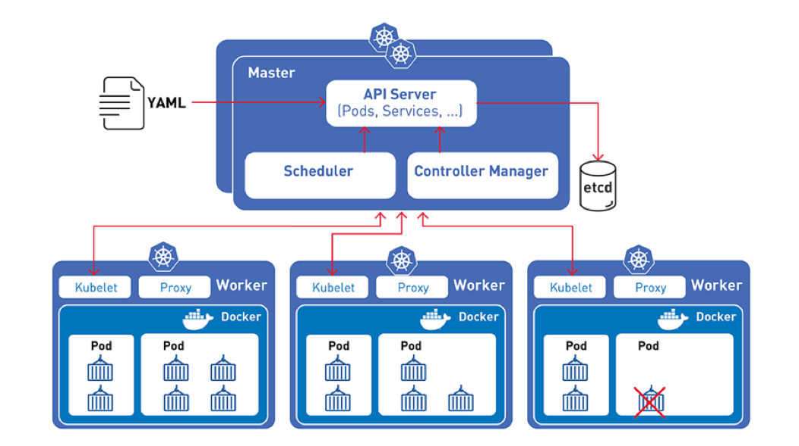
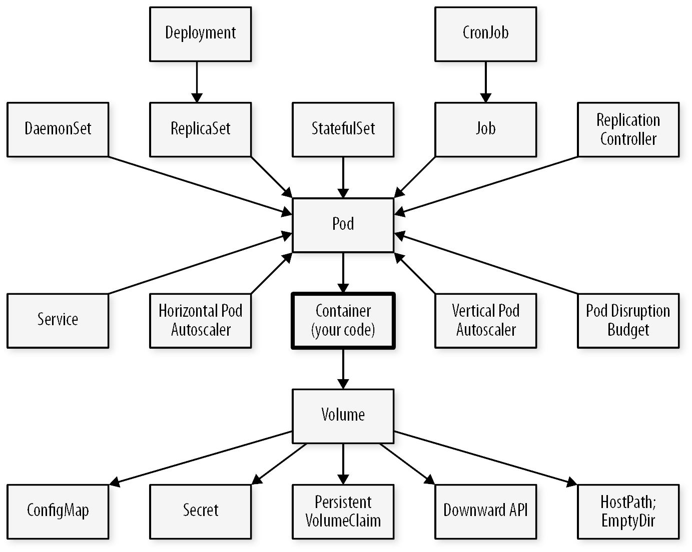

- Kubernetes est une solution d'orchestration de conteneurs extrêmement populaire.
- Le projet est très ambitieux : une façon de considérer son ampleur est de voir Kubernetes comme un système d'exploitation (et un standard ouvert) pour les applications distribuées et le cloud.
- Le projet est développé en Open Source au sein de la Cloud Native Computing Foundation.

## Architecture de Kubernetes

- Kubernetes rassemble en un cluster et fait coopérer un groupe de serveurs appelés **noeuds** (nodes).

- Kubernetes a une architecture **Control Plane/workers** composée d'un **control plane** et de nœuds de calculs (**workers**).

- Cette architecture permet essentiellement de rassembler les machines en un **cluster unique** sur lequel on peut faire tourner des **"charges de calcul" (workloads)** très diverses.

- Sur un tel cluster le déploiement d'un workload prend la forme de **ressources (objets k8s)** qu'on **décrit sous forme de code** et qu'on crée ensuite effectivement via l'API Kubernetes.

- Pour uniformiser les déploiement logiciel Kubernetes est basé sur le standard des **conteneurs** (défini aujourd'hui sous le nom **Container Runtime Interface**, Docker est l'implémentation la plus connue).

- Plutôt que de déployer directement des conteneurs, Kubernetes crée des **aggrégats de un ou plusieurs conteneurs** appelés des **Pods**. Les pods sont donc l'unité de base de Kubernetes.

## Philosophie 
### Historique et popularité

Kubernetes est un logiciel développé originellement par Google et basé sur une dizaine d'années d'expérience de déploiement d'applications énormes (distribuées) sur des clusters de machines.

Maintenant à part entière au sein de Cloud Native, son ancêtre est l'orchestrateur borg utilisé par Google dans les années 2000.

La première version est sortie en 2015 et k8s est devenu depuis l'un des projets open source les plus populaires du monde.

L'écosystème logiciel de Kubernetes s'est développée autour la **Cloud Native Computing Foundation** qui comprend notamment : Google, CoreOS, Mesosphere, Red Hat, Twitter, Huawei, Intel, Cisco, IBM, Docker, Univa et VMware. Cette fondation vise au pilotage et au financement collaboratif du développement de Kubernetes (un peut comme la Linux Foundation).

### Les 3 gros changements

Kubernetes se trouve au coeur de trois transformations profondes techniques, humaines et économiques de l'informatique:

- Le cloud
- La conteneurisation logicielle
- Le mouvement DevOps

Il est un des projets qui symbolise et supporte techniquement ces transformations. D'où son omniprésence dans les discussions informatiques actuellement.

#### Le Cloud

- Le cloud est un mouvement de réorganisation technique et économique de l'informatique.
- On retourne à la consommation de "temps de calcul", pour remplacer le serveur dédié.
- Pour organiser cela on définit trois niveaux, techniques et économiques:
  - **Software as a Service**: location de services à travers internet pour les usagers finaux
  - **Plateforme as a Service**: location d'un environnement d'exécution logiciel flexible à destination des développeurs
  - **Infrastructure as a Service**: location de resources "matérielles" à la demande pour installer des logiciels sans avoir à maintenir un data center.

#### Conteneurisation

La conteneurisation est permise par l'isolation au niveau du noyau du système d'exploitation du serveur : les processus sont isolés dans des namespaces au niveau du noyau. Cette innovation permet de simuler l'isolation sans ajouter une couche de virtualisation comme pour les machines virtuelles.

Ainsi les conteneurs permettent d'avoir des performances proche d'une application traditionnelle tournant directement sur le système d'exploitation hote et ainsi d'optimiser les ressources.

Les images de conteneurs sont aussi beaucoup plus légers qu'une image de VM.

Les technologies de conteneurisation permettent donc de faire des boîtes isolées avec les logiciels pour apporter l'uniformisation du déploiement:

- Une façon standard de packager un logiciel.
- Cela permet d'assembler de grosses applications comme des briques
- Cela réduit la complexité grâce:
  - à l'intégration de toutes les dépendance déjà dans le conteneur
  - au principe d'immutabilité qui implique de jeter les conteneurs ( Pets vs Cattle ) ce qui rend l'infra prédictible.

#### DevOps

- Faire le pont entre les développeurs et les administrateurs système.
- Calquer les rythmes de travail sur l'organisation agile du développement logiciel
- Rapprocher techniquement la gestion de l'infrastructure du développement avec l'infrastructure as code.
  - concrêtement on écrit des fichiers de code pour gérer les éléments d'infra
  - l'état de l'infrastructure est plus claire et documentée par le code
  - la complexité est plus gérable car tout est déclaré et modifiable au fur et à mesure de façon centralisée
  - l'usage de git et des branches/tags pour la gestion de l'évolution d'infrastructure

### Apports techniques de Kubernetes pour le DevOps

Abstraction et standardisation des infrastructures: 
- Langage descriptif et incrémental: on décrit ce qu'on veut plutôt que la logique complexe pour l'atteindre
- Logique opérationnelle intégrée dans l'orchestrateur: la responsabilité de l'état du cluster est laissé au controlleur k8s ce qui simplifie le travail

On peut alors espérer **fluidifier** la gestion des défis techniques d'un grosse application et atteindre plus ou moins la livraison logicielle continue (CD de CI/CD)

#### Architecture logicielle optimale pour Kubernetes

Kubernetes est très versatile et permet d'installer des logiciels traditionnels "monolithiques" (gros backends situés sur une seule machine).

Cependant aux vues des transformations humaines et techniques précédentes, l'organisation de Kubernetes prend vraiment sens pour le développement d'applications microservices:

  - des applications avec de nombreux de "petits" services.
  - chaque service a des problématiques très limitées (gestion des factures = un logiciel qui fait que ça)
  - les services communiquent par le réseaux selon différents modes/API (REST, gRPC, job queues, GraphQL)

Les microservices permettent justement le DevOps car:
  - ils peuvent être déployés séparéments
  - une petite équipe gère chaque service ou groupe thématique de services

  Nous y reviendrons pour expliquer l'usage des ressources Kubernetes.

## Objets fondamentaux de Kubernetes

- Les **pods** Kubernetes servent à grouper des conteneurs fortement couplés en unités d'application
- Les **deployments** sont une abstraction pour **créer ou mettre à jour** (ex : scaler) des groupes de **pods**.
- Enfin, les **services** sont des points d'accès réseau qui permettent aux différents workloads (deployments) de communiquer entre eux et avec l'extérieur.

Au delà de ces trois éléments, l'écosystème d'objets de Kubernetes est vaste et complexe

## Kubernetes entre Cloud et auto-hébergement

Un des intérêts principaux de Kubernetes est de fournir un modèle de Plateform as a Service (PaaS) suffisamment versatile qui permet l'interopérabilité entre des fournisseurs de clouds différents et des solutions auto-hébergées (on premise).

Cependant cette interopérabilité n'est pas automatique (pour les cas complexes) car Kubernetes permet beaucoup de variations. Concrêtement il existe des variations entre les installations possibles de Kubernetes  

## Distributions de Kubernetes

Kubernetes est avant tout un ensemble de standards qui peuvent avoir des implémentations concurrentes. Il existe beaucoup de variétés (**flavours**) de Kubernetes, implémentant concrètement les solutions techniques derrière tout ce que Kubernetes ne fait que définir : solutions réseau, stockage (distribué ou non), loadbalancing, service de reverse proxy (Ingress), autoscaling de cluster (ajout de nouvelles VM au cluster automatiquement), monitoring…

Il est très possible de monter un cluster Kubernetes en dehors de ces fournisseurs, mais cela demande de faire des choix (ou bien une solution _opinionated_ ouverte comme Rancher) et une relative maîtrise d'un nombre varié de sujets (bases de données, solutions de loadbalancing, redondance du stockage…).

C'est là le compromis de kubernetes : tout est ouvert et standardisé, mais devant la complexité et connaissance nécessaire pour mettre en place sa propre solution (stockage distribué par exemple) il est souvent préférable de louer un cluster chez un fournisseur quitte à retomber dans un certain [*vendor lock-in* (enfermement propriétaire)](https://fr.wikipedia.org/wiki/Enfermement_propri%C3%A9taire).

Quelques variantes connues de Kubernetes:

- Google Kubernetes Engine (**GKE**) (Google Cloud Plateform): L'écosystème Kubernetes développé par Google. Très populaire car très flexible tout en étant l'implémentation de référence de Kubernetes.
- Azure Kubernetes Services (**AKS**) (Microsoft Azure): Un écosystème Kubernetes axé sur l'intégration avec les services du cloud Azure (stockage, registry, réseau, monitoring, services de calcul, loadbalancing, bases de données…).
- Elastic Kubernetes Services (**EKS**) (Amazon Web Services): Un écosystème Kubernetes assez standard à la sauce Amazon axé sur l'intégration avec le cloud Amazon (la gestion de l'accès, des loadbalancers ou du scaling notamment, le stockage avec Amazon EBS, etc.).
- **Rancher**: Un écosystème Kubernetes très complet, assez _opinionated_ et entièrement open-source, non lié à un fournisseur de cloud. Inclut l'installation de stack de monitoring (Prometheus), de logging, de réseau mesh (Istio) via une interface web agréable. Rancher maintient aussi de nombreuses solutions open source, comme par exemple Longhorn pour le stockage distribué.
- **K3S**: Un écosystème Kubernetes fait par l'entreprise Rancher et axé sur la légèreté. Il remplace `etcd` par une base de données Postgres, utilise Traefik pour l'ingress et Klipper pour le loadbalancing.
- **Openshift** : Une version de Kubernetes configurée et optimisée par Red Hat pour être utilisée dans son écosystème. Tout est intégré donc plus guidé, avec l'inconvénient d'être un peu captif·ve de l'écosystème et des services vendus par Red Hat.

